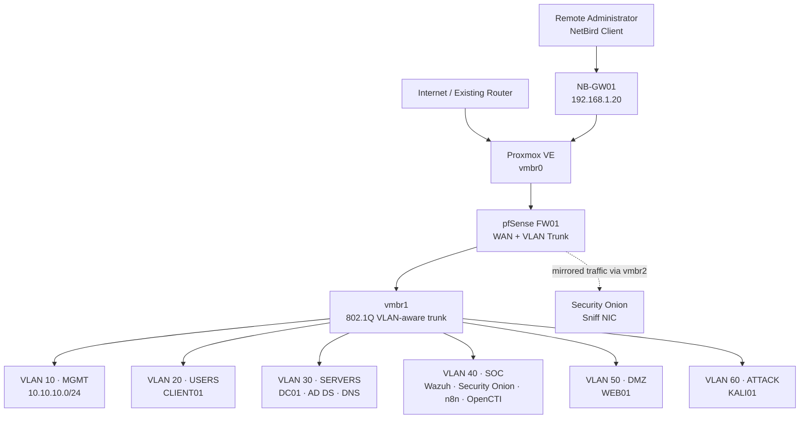

# SOC Proxmox Lab

An interactive, bilingual architecture and implementation blueprint for a complete Security Operations Center lab on **Proxmox VE**.

The project models a small virtual company with network segmentation, identity services, endpoint and network monitoring, threat intelligence, SOAR automation, controlled attack simulation, and Zero Trust remote access.

## Interactive guides

- [English interactive guide](https://ameencys.github.io/soc-proxmox-lab/soc-proxmox-complete-guide-en.html)
- [Arabic interactive guide](https://ameencys.github.io/soc-proxmox-lab/soc-proxmox-complete-guide.html)
- [GitHub Pages landing page](https://ameencys.github.io/soc-proxmox-lab/)

## Technology stack

| Layer | Platform | Purpose |
| --- | --- | --- |
| Hypervisor | Proxmox VE | Hosts and isolates all virtual machines |
| Firewall | pfSense | VLAN gateways, routing, NAT, policy enforcement, and syslog |
| Identity | Windows Server 2022 | Active Directory Domain Services and DNS for `corp.lab` |
| Endpoint | Windows 11 Pro | Domain-joined employee workstation |
| Linux/DMZ | Ubuntu Server 24.04 | Test web/application server and Linux telemetry source |
| SIEM/XDR | Wazuh | Endpoint telemetry, FIM, SCA, vulnerability detection, and alerts |
| NDR/NSM | Security Onion | Suricata, Zeek, and packet visibility |
| Threat Intelligence | OpenCTI | STIX 2.1 intelligence, indicators, relationships, and enrichment |
| SOAR | n8n | Alert enrichment, tickets, approval, and response orchestration |
| Remote Access | NetBird | Zero Trust access to private resources without public dashboards |
| Attack Simulation | Kali Linux | Authorized detection-validation activity inside an isolated VLAN |

## Network architecture

All inter-VLAN traffic is routed and filtered by pfSense. Kali cannot access the management or SOC zones. Management dashboards are reached through NetBird rather than public port forwarding.

## VM resource plan

| VMID | Hostname | Role | vCPU | RAM | Disk | Network |
| ---: | --- | --- | ---: | ---: | ---: | --- |
| 100 | FW01 | pfSense | 2 | 4 GB | 20 GB | vmbr0 + vmbr1 trunk |
| 105 | NB-GW01 | NetBird routing peer | 2 | 4 GB | 20 GB | vmbr0 |
| 110 | DC01 | Windows Server / AD DS / DNS | 4 | 8 GB | 100 GB | VLAN 30 |
| 120 | CLIENT01 | Windows 11 Pro endpoint | 4 | 8 GB | 80 GB | VLAN 20 |
| 130 | WEB01 | Ubuntu Server / DMZ application | 2 | 4 GB | 50 GB | VLAN 50 |
| 140 | WAZUH01 | Wazuh all-in-one | 4 | 8 GB | 100 GB | VLAN 40 |
| 150 | SO01 | Security Onion standalone | 4 | 24 GB | 300 GB | VLAN 40 + vmbr2 sniff |
| 160 | SOAR01 | n8n automation | 2 | 4 GB | 40 GB | VLAN 40 |
| 165 | CTI01 | OpenCTI | 8 | 24 GB | 250 GB | VLAN 40 |
| 170 | KALI01 | Authorized attack workstation | 4 | 4 GB | 80 GB | VLAN 60 |

**Allocated totals:** 36 vCPU, 92 GB RAM, and 1,040 GB of virtual disk.

## Physical host recommendation

- Practical minimum: 128 GB RAM and 2 TB NVMe.
- Preferred: 160–192 GB RAM and 3–4 TB storage, or separate PCAP storage.
- Reserve 12–20 GB RAM for Proxmox and filesystem cache.
- On a smaller server, run OpenCTI or Security Onion on demand instead of keeping every heavy VM online.

## Important notes

- OpenCTI and n8n are not ISO images. Deploy each on a dedicated Ubuntu Server VM using Docker Compose.
- `virtio-win.iso` contains Windows guest drivers; it is not an operating system.
- Snapshots are useful rollback points but are not backups.
- Offensive testing must remain inside the authorized isolated lab.
- Review linked official documentation in the interactive guides before installation because versions and requirements change.

## Disclaimer

This project is intended for education, blue-team training, and authorized security testing only.
